# Math Plotter

Insert mathematical graphs into Obsidian notes through a form. You type normal math (`sin^2(x)`, `x^2+y^2`) — not TikZ, PGFPlots, or Octave syntax. The plugin stores a small JSON block in your note and renders it as SVG in Reading View.

Desktop only. Version **0.1.3**.

---

## Sample output

These SVGs were exported from Math Plotter and live in [`samples/`](samples/):

| | | |
|:---:|:---:|:---:|
|  |  |  |
| 2D function | 2D function + labeled point | Oscillating 2D plot |
|  |  |  |
| 3D surface (heat colormap) | Heat-equation style surface | PDE solution surface |
|  |  | |
| Another 3D PDE plot | Wireframe 3D surface | |

Graphs render with a transparent background so they sit cleanly on your note.

---

## What you can plot

| Type | What you enter |
|------|----------------|
| **2D function** | `y = f(x)` — e.g. `sin^2(x)` |
| **3D surface** | `z = f(x, y)` — e.g. `x^2+y^2` |
| **ODE** | An explicit solution you already have — e.g. `exp(-2*x)` for `y' = -2y` |
| **PDE** | An explicit solution surface — e.g. `exp(-2*t)*sin(x)*sin(y)` with parameter `t` |
| **Parametric 2D / 3D** | `x(t)`, `y(t)`, optional `z(t)` — full modal only |
| **Data** | `(x, y)` pairs |
| **Points** | Labeled points on top of any plot (Points tab in the modal) |

Math Plotter does **not** symbolically solve ODEs or PDEs. You supply the solution expression.

---

## How to insert a graph

**Ribbon** — click the line-chart icon (**Insert Function Plot**).

**Command palette** — run **Insert Function Plot**.

**Empty code block** — type a fenced block with nothing inside:

````markdown
```graph

```
````

An inline builder appears. Use **More Options** to open the full modal with tabs for Equation, Ranges, Style, Size, and Points.

---

## Rendered graph toolbar

Once a graph is drawn, hover the toolbar:

**Edit · Refresh · − · 100% · + · Export · Export PNG**

- **Edit** opens the full graph builder (including the Size tab).
- **Refresh** redraws the fast SVG preview.
- **− / % / +** change on-screen zoom only (no recompile).
- **Export** downloads SVG; **Export PNG** downloads a PNG.

Math Plotter does not read or write the system clipboard.

---

## Expression syntax

Write calculator-style math in function fields:

```text
x^2 + y^2
sin^2(x)+cos^2(y)
exp(-2*t)*sin(x)*sin(y)
sqrt(x^2+y^2)
ln(x)          (log(x) works too)
pi / π
2sin(x)
```

The plugin saves your expression as-is in the `function` field. Compilation to PGFPlots or Octave happens at render time only.

---

## Style and sizing

**2D / ODE** — theme-aware line color by default (`auto`), optional grid, custom line width.

**3D / PDE 3D** — colored heat mesh by default; switch to wireframe or solid in the Style tab.

**LaTeX size** — preset or custom width/height; affects export quality and axis labels.

**Display scale** — 0.5×–2.5× zoom in Obsidian only; adjustable from the toolbar without recompiling.

---

## Installation

### From source (recommended for development)

```bash
cd Vault/.obsidian/plugins/math-plotter
npm install
npm run build
```

Enable **Settings → Community plugins → Math Plotter**, then reload Obsidian.

Deploy the whole plugin folder, not just `main.js`:

```text
main.js
manifest.json
styles.css
assets/tikzjax/node/    ← needed for TikZJax high-quality rendering
```

### From GitHub releases

Community installs get `main.js`, `manifest.json`, and `styles.css`. Fast SVG rendering works with those three files.

For TikZJax assets, build from source or run `npm run release:package` locally to create `math-plotter-full.zip`. See [RELEASING.md](RELEASING.md).

---

## Settings

**Settings → Math Plotter**

| Setting | Notes |
|---------|-------|
| Output format | SVG in Reading View; PNG available on export |
| LuaLaTeX fallback | Off by default; retries failed TikZJax renders if TeX is installed |
| Octave engine | Off by default; external numerical sampler for advanced use |
| Prefer Octave for 3D / ODE·PDE numeric | Only relevant when Octave is enabled |
| Debug mode | Shows generated TikZ in error details |

Per-graph size is set in the builder (**Size** tab) or the inline builder preset — not in plugin settings.

---

## Rendering (under the hood)

Normal graphs use a **built-in JavaScript sampler** and draw SVG directly. That is the default path — fast, no WASM compile on every edit.

**TikZJax** (bundled WebAssembly) compiles generated PGFPlots when needed — for example when fast preview is unavailable for a graph type, an error panel offers **High quality render**.

**Octave** (optional) samples numerically via `octave-cli` and feeds CSV data to PGFPlots. Not required for everyday plotting.

**LuaLaTeX** (optional) is a fallback when TikZJax cannot compile a particular plot.

---

## Requirements

- **Obsidian Desktop** (required)
- **Node.js** (build from source only)

Optional: GNU Octave CLI (`octave-cli`), LuaLaTeX + Poppler for fallbacks.

---

## Troubleshooting

**Graph too small** — open Edit → Size, pick Large or Full width, or use the toolbar zoom.

**Surface clipped** — widen the z range. For `z = x^2` on a wide x range, a narrow z range will cut most of the surface off.

**TikZJax failed** — enable LuaLaTeX fallback in Advanced settings if you have MacTeX or TeX Live.

**Octave issues** — set the path to `octave-cli` (e.g. `/opt/homebrew/bin/octave-cli` on Apple Silicon), not the GUI app. Use **Test Octave** in settings.

**Invalid block** — use **Edit Graph** or **Reset Block** on the error panel.

---

## Development

```bash
npm install
npm run build
npm run release:check
npm run dev              # watch mode
npm run test:syntax
npm run test:tick-labels
```

Main source areas: `src/graphBuilderModal.ts`, `src/graphProcessor.ts`, `render/`, `graphPreprocessor.ts`, `sampler/`, `octave/`.

Release process: [RELEASING.md](RELEASING.md)

---

## License

[MIT](LICENSE) — Copyright © Sharbel Marshi
