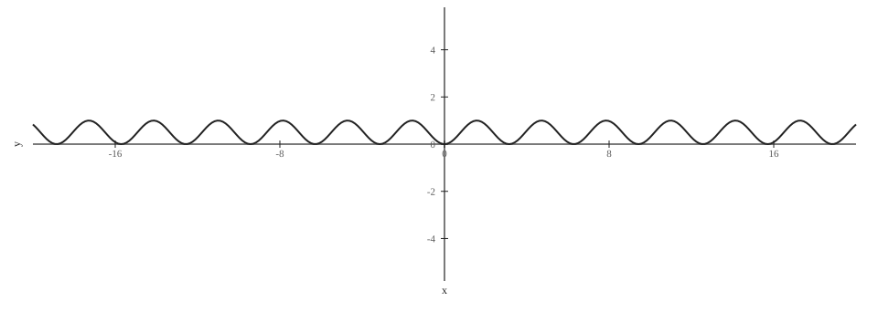
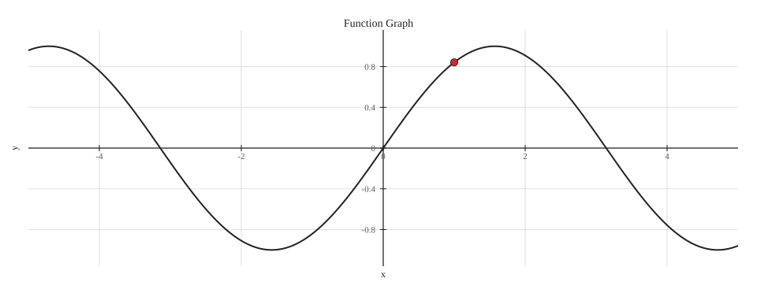
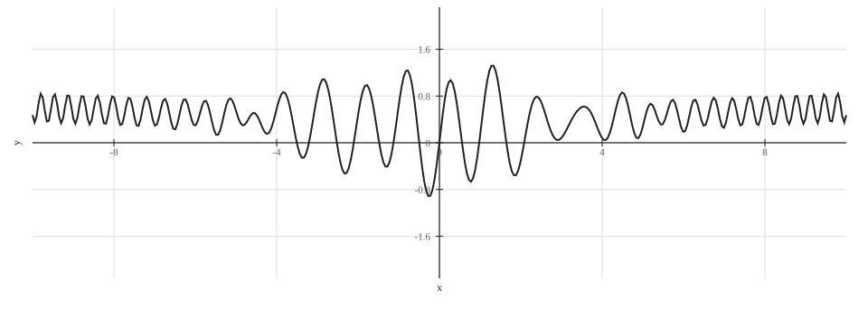
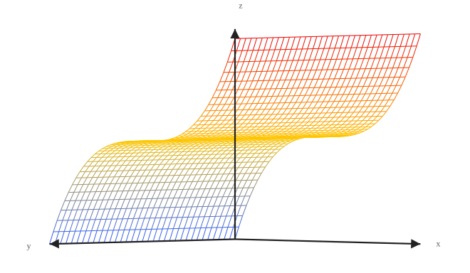
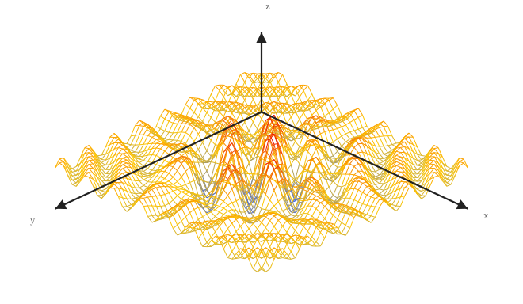
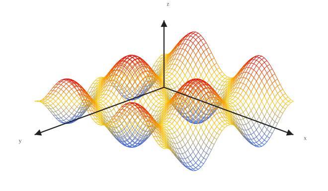
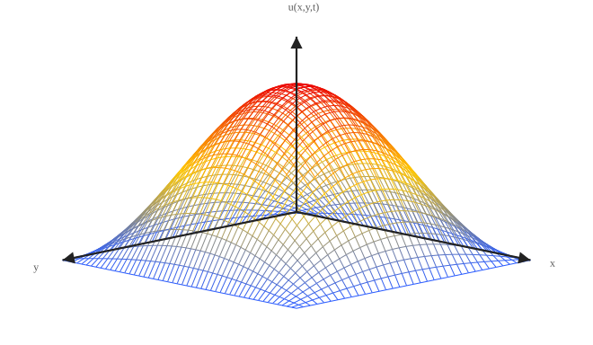
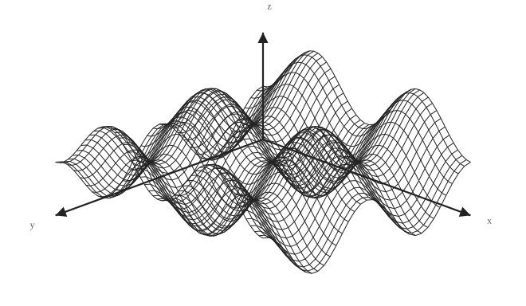

# Math Plotter

Insert mathematical graphs into Obsidian notes through a form. You type normal math (`sin^2(x)`, `x^2+y^2`) and the plugin takes care of the rest — no TikZ, PGFPlots, or Octave syntax to learn. Each graph is stored as a small JSON block in the note and rendered as an SVG in Reading View.

After installing, enable it under **Settings → Community plugins → Math Plotter** and reload Obsidian.

## Sample output

These SVGs were exported from Math Plotter:

| | | |
|:---:|:---:|:---:|
|  |  |  |
| 2D function | 2D function + labeled point | Oscillating 2D plot |
|  |  |  |
| 3D surface (heat colormap) | Heat-equation style surface | PDE solution surface |
|  |  | |
| Another 3D PDE plot | Wireframe 3D surface | |

Backgrounds are transparent, so graphs sit directly on the note.

## What's new

The latest update is mostly about touching the graphs instead of re-opening the editor:

- **Drag to rotate.** 3D surfaces can be orbited by dragging them. The view follows your pointer and the new angle is written back into the graph block when you release, so it survives reloads.
- **Draggable points.** Press and drag a labeled point to move it — on 2D plots and on 3D plots (where it moves in the x/y plane). If a point is sitting where you want to grab the surface, hold Shift to rotate instead.
- **Pinch to zoom.** A trackpad pinch or Ctrl+scroll over a graph changes its on-screen size, same as the toolbar zoom. Nothing recompiles.
- **LaTeX input.** Expressions accept LaTeX now: `\frac{x^2}{2}`, `\sqrt[3]{x}`, Greek letters, `|x|`, floor/ceil brackets, `log_2(x)`, even finite `\sum` and `\prod`. Titles and axis labels can carry `$math$` too.
- **More functions** than before: sec/csc/cot, inverse trig (in radians), inverse hyperbolics, floor, ceil, round, sign, mod, atan2, pow, log2, log10, factorial.
- Axis line width and label text size are now adjustable per graph.

## What you can plot

| Type | What you enter |
|------|----------------|
| **2D function** | `y = f(x)` — e.g. `sin^2(x)` |
| **3D surface** | `z = f(x, y)` — e.g. `x^2+y^2` |
| **ODE** | An explicit solution you already have — e.g. `exp(-2*x)` for `y' = -2y` |
| **PDE** | An explicit solution surface — e.g. `exp(-2*t)*sin(x)*sin(y)` with parameter `t` |
| **Parametric 2D / 3D** | `x(t)`, `y(t)`, optional `z(t)` — full modal only |
| **Data** | `(x, y)` pairs |
| **Points** | Labeled points on top of any plot (Points tab in the modal) |

Math Plotter doesn't symbolically solve ODEs or PDEs — you plot a solution you already know. If you want numerical solving, enable the Octave engine in the settings tab.

## Inserting a graph

Three ways to get one into a note:

- click the line-chart ribbon icon (**Insert Function Plot**),
- run **Insert Function Plot** from the command palette,
- or just type an empty fenced code block:

````text
```graph

```
````

An inline builder appears in the note. **More Options** opens the full modal, with tabs for Equation, Ranges, Style, Size, and Points.

## Working with a rendered graph

Hovering a graph shows its toolbar: **Edit · Refresh · − · 100% · + · Export · Export PNG**. Edit reopens the builder, Refresh redraws the preview, the −/+ group is on-screen zoom (0.5×–2.5×, no recompile), and the export buttons download SVG or PNG.

The graph itself responds to the pointer:

- drag a 3D surface to rotate it (Shift+drag forces rotation if a point marker is under the cursor),
- press and drag a point marker to reposition it,
- pinch or Ctrl+scroll to zoom.

Rotation and point moves are saved back into the note's graph block when you let go. Exports capture whatever you're currently looking at, including a rotated view and moved points.

Math Plotter does not read or write the system clipboard.

## Writing math

Calculator-style input works everywhere:

```text
x^2 + y^2
sin^2(x)+cos^2(y)
exp(-2*t)*sin(x)*sin(y)
sqrt(x^2+y^2)
ln(x)          (log(x) works too)
pi / π
2sin(x)
```

LaTeX works too — pasted from a note or typed directly:

```text
\frac{x^2}{2} + \sqrt[3]{y}
e^{-t}\sin(\pi x)
\sum_{n=1}^{10} \frac{x^n}{n}
|x|,  \lfloor x \rfloor,  \lceil x \rceil
log_2(x)
```

Greek commands (`\alpha`) and typed Unicode (`α`, `x²`, `√`) are normalized before evaluation, absolute-value bars become `abs(...)`, and `\sum` / `\prod` with finite bounds are expanded out. Inverse trig functions return radians.

Titles and axis labels can contain math wrapped in `$…$`, e.g. `$e^{-y}\sin(x)$`. The LaTeX render compiles it for real; the fast preview approximates it with Unicode, so you'd see `e⁻ʸ sin(x)`.

Your expression is saved as-is in the block's `function` field — compilation to PGFPlots or Octave happens at render time only.

## Style and sizing

2D and ODE plots use a theme-aware line color by default (`auto`), with optional grid and custom line width. 3D and PDE surfaces default to a heat-colored mesh; the Style tab can switch them to wireframe or solid.

Axis line width (0.5–4) and label text size (8–32 px) are set per graph in the Style tab.

Two different size knobs, easy to confuse:

- **LaTeX size** — the real width/height of the figure. Affects export quality and label proportions. Preset or custom, in the Size tab.
- **Display scale** — how big the graph appears in Obsidian, 0.5× to 2.5×. Changed from the toolbar or by pinching, without recompiling anything.

## Settings

Under **Settings → Math Plotter**:

| Setting | Notes |
|---------|-------|
| Output format | SVG in Reading View; PNG available on export |
| LuaLaTeX fallback | Off by default; retries failed TikZJax renders if TeX is installed |
| Octave engine | Off by default; external numerical sampler for advanced use |
| Prefer Octave for 3D / ODE·PDE numeric | Only relevant when Octave is enabled |
| Debug mode | Shows generated TikZ in error details |

Per-graph size lives in the builder (Size tab), not in plugin settings.

## How rendering works

Normal graphs go through a built-in JavaScript sampler that draws SVG directly. That's the default path — fast, and no WASM compile on every edit.

When a graph needs more than the fast path can do, TikZJax (bundled WebAssembly) compiles the generated PGFPlots; the error panel offers a **High quality render** button in those cases. Octave, if you enable it, samples numerically through `octave-cli` and feeds CSV data to PGFPlots — not required for everyday plotting. LuaLaTeX is a last-resort fallback for plots TikZJax can't compile.

## Requirements

- Obsidian Desktop
- Node.js, only if building from source

Optional: GNU Octave CLI (`octave-cli`), LuaLaTeX + Poppler for the fallbacks.

## Troubleshooting

**Graph too small** — open Edit → Size and pick Large or Full width, or just zoom with the toolbar / pinch.

**Surface clipped** — widen the z range. For `z = x^2` on a wide x range, a narrow z range cuts most of the surface off.

**TikZJax failed** — enable the LuaLaTeX fallback in Advanced settings if you have MacTeX or TeX Live installed.

**Octave issues** — point the path at `octave-cli` (e.g. `/opt/homebrew/bin/octave-cli` on Apple Silicon), not the GUI app, and use **Test Octave** in settings.

**Invalid block** — use **Edit Graph** or **Reset Block** on the error panel.

Release process: [RELEASING.md](RELEASING.md)

## License

[MIT](LICENSE) — Copyright © Sharbel Marshi
